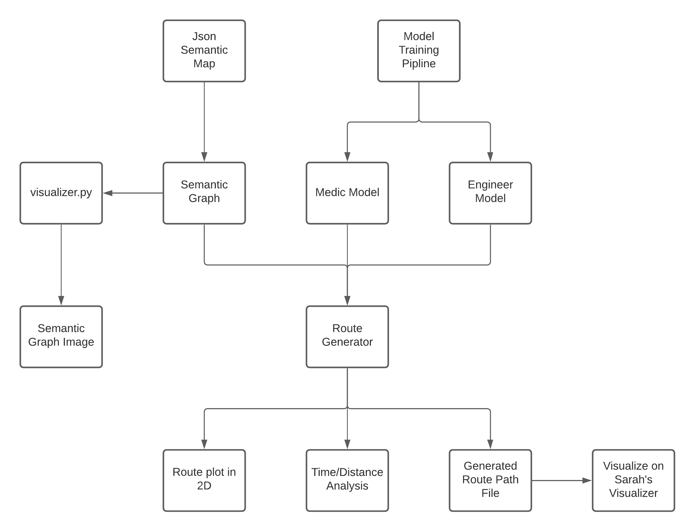

# A simple walk-through of the pipeline

### Basic Structure

```
Attention-ASIST/
├─ asist/
│  ├─ data/                     <- data folder that contains json semantic map
│  ├─ graph                     <- semantic graph class
│  ├─ mapparser                 <- load semantic map json data and creates semantic graph
│  ├─ visulizer                 <- visulizer that can plot semantic graph to png
│  └─ routeGenerator            <- generating routes/path from trained model
├─ problems/
│  ├─ op/
│  ├─ pctsp/
│  ├─ tsp/
│  └─ vrp/
│     ├─ problem_pcvrp (cvrpp)  <- cvrpp problem related (engineer)
│     └─ problem_vrp (cvrp)     <- cvrp problem related (medic)
├─ params.yaml                  <- contains training hyperparameters
├─ outputs                      <- contains all trained model
└─ run.py                       <- run this to start training
```

For detailed original Transformer+REINFORCE model documentation, please visit [attention-learn-to-route](https://github.com/wouterkool/attention-learn-to-route)

The modification we made for the medic model (cvrp) and the engineer model (cvrpp) mainly locates in the `problems/vrp` folder

### Pipeline Diagram



### Load Json Semantic Map to create Semantic Graph and Visualize it

The latest json data we use locates in the `asist/data/json/Saturn` folder. For example, the data we used for the one medic and two engineers model is `Saturn_trial_416.json`

This code snippet could load the json semantic map file and create the semantic graph:

```python
with open('data/json/Saturn/Saturn_trial_416.json') as json_file:
    json_data = json.load(json_file)

graph = MapParser.parse_saturn_map(json_data)
```

### Train a medic model

In `params.yaml`, especially specify the following:

```yaml
problem: cvrp                   # This let the model know you want to use problem_cvrp
problem_params:
  MEDIC_TOOL_DURABILITY: 20     # Tool durability of the medic
graph_size: 55                  # Graph size: number of all objective nodes that medic need to consider, here it is the number of all victims
```

run `run.py` with the argument `--arg_yaml_file params.yaml` to use the parameters you specified.

Note: The actual training uses very large parameter size (batch size, network size), and your local machine might freeze if you train it like that. For testing, you can create a `params_test.yaml` and use small parameter size

If everything goes well, you should see a new trained model pop up in the `outputs` folder. To save space in the repository, we stored all trained model on AWS and managed through Data-Version Control (DVC)

### Train an engineer model

In `params.yaml`, especially specify the following:

```yaml
problem: pcvrp                          # This let the model know you want to use problem_pcvrp
problem_params:
  PLAYER_ROLE: engineer                 # this arg is here because we previously use pcvrp to solve both medic and engineer
  MEDIC_MODEL_FILE: pretrained/cvrp_20  # trained medic model dependency
  MEDIC_GRAPH_SIZE: 55                  # number of victims (contains high value)
  RUBBLE_GRAPH_SIZE: 18                 # number of (must-visit / blocking) rubbles
  HIGH_VALUE_VICTIM_SIZE: 7             # number of sync node size, which is the number of high-value victims + freezing plates
  MEDIC_SPEED: 0.0091                   # medic speed after conversion
  ENGINEER_SPEED: 0.0065                # engineer speed after conversion
  MEDIC_TOOL_DURABILITY: 20
  ENGINEER_TOOL_DURABILITY: 131
  DISTANCE_RATIO: 0.001663                  # Saturn to 2D[0-1] conversion factor
  HIGH_VALUE_MISMATCH_PENALTY_COEFF: 0.004  # coefficient 1
  LATE_RUBBLE_PENALTY_COEFF: 1.757          # coefficient 2

graph_size: 25                  # Graph size: number of all objective nodes that medic need to consider, here it is RUBBLE_GRAPH_SIZE + HIGH_VALUE_VICTIM_SIZE
```